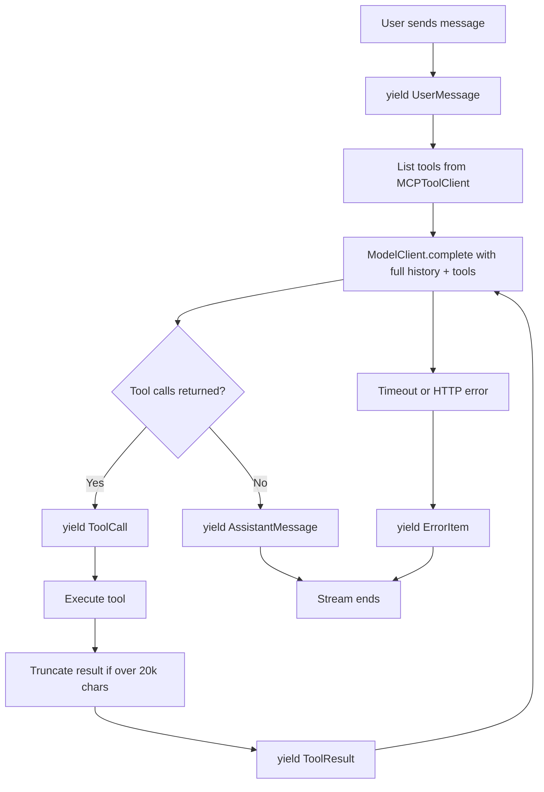

# ChatAgent

## 1. Summary
A local chat interface that streams conversation items in real time from a FastAPI backend. The user sends a message, the model decides whether to call filesystem tools through MCP, and each item (user message, tool call, tool result, assistant reply, error) is streamed to the frontend as a Server-Sent Event so the UI renders progressively — the spinner on a tool call turns to ✓ when the result arrives, and assistant replies render with markdown and syntax highlighting.

## 2. Model + MCP Tool Used
Model client: OpenRouter chat completions via `OpenRouterClient` in `backend/app/infrastructure/openrouter/client.py`.

Configured model in `.env`: `OPENROUTER_MODEL` — tested with `openai/gpt-oss-20b:free` and `anthropic/claude-3-haiku`. Lower-cost models were prioritised for demo runs; HTTP 402 was returned during live tests on some free-tier models.

Tool layer: official MCP Python SDK using `@modelcontextprotocol/server-filesystem` over stdio in `backend/app/infrastructure/mcp/client.py`. Filesystem MCP was chosen because it is simple to demo, easy to verify in logs, and easy to sandbox.

## 3. API Config
Required env vars in `backend/.env`:

- `OPENROUTER_API_KEY`
- `OPENROUTER_MODEL`
- `MCP_FILESYSTEM_ROOT`
- `OPENROUTER_BASE_URL`
- `OPENROUTER_REFERER`
- `CORS_ORIGIN`

## 4. Run Instructions
Backend:
```powershell
cd backend
python -m pip install -r requirements.txt
python -m uvicorn app.main:app --reload --port 8000
```

Frontend:
```powershell
cd frontend
npm install
npm run dev
```

Frontend tests:
```powershell
cd frontend
npm test
```

Quick API test (non-streaming):
```powershell
$body = @{ message = 'List files in the demo workspace and then read notes.txt' } | ConvertTo-Json
Invoke-RestMethod -Method Post -Uri 'http://127.0.0.1:8000/api/chat' -ContentType 'application/json' -Body $body
```

## 5. Orchestration Flow
The loop lives in `backend/app/application/chat_orchestrator.py`. `chat_stream` yields each item as it is produced — the user message first, then each tool call immediately before its tool is executed, the tool result after execution, and the final assistant message last. `chat` (used by the legacy endpoint) collects the same items and returns them as a list.



## 6. Design Decisions and Trade-offs
**Ports and adapters:** the orchestrator depends on `ModelClient` and `ToolClient` protocols, not concrete clients. That keeps unit tests isolated.

**SSE streaming:** `POST /api/chat/stream` yields newline-delimited `data:` events. The frontend consumes them with a `for await` loop using `fetch` + `ReadableStream` — no EventSource (which does not support POST). Each item is appended to the reactive list as it arrives, giving real-time feedback without a WebSocket.

**Tool call timing:** a 200 ms `setTimeout` in the frontend loop guarantees the spinner is visible even when the tool executes in under one frame. Execution duration (ms or s) is shown next to the ✓ icon.

**In-memory state:** conversation history is stored in `ChatOrchestrator._conversation`. Simple for a single-user demo, not multi-user safe.

**localStorage persistence:** the frontend serialises `items` to `localStorage` (debounced 200 ms) so conversations survive page refreshes. A "New chat" button clears both the UI state and storage.

**Legacy endpoint kept:** `POST /api/chat` still returns the full list for backward-compatibility with the integration tests.

**Filesystem scope:** MCP is restricted to `demo-workspace`, root-resolved in `backend/app/api/dependencies.py`.

**Frontend testing:** Vitest + `@vue/test-utils` with jsdom covers SSE stream parsing (`chatApi`), composer keyboard behaviour, and `ConversationList` item dispatch and loading states.

**Out of scope by design:** auth, multi-user routing, persistent server-side storage, and message editing.

## 7. What I'd Do Differently With More Time
1. Add provider fallback and a local mock model mode so demos keep working when external model access fails.
2. Move conversation state to persistent storage keyed by conversation ID to support multi-turn, multi-user sessions.
3. Add integration test coverage for the streaming endpoint end-to-end (currently only unit-tested).
4. Replace the fixed 200 ms spinner delay with a backend-driven progress event so the delay reflects actual tool latency.
5. Add a conversation sidebar to switch between past sessions stored in localStorage.
