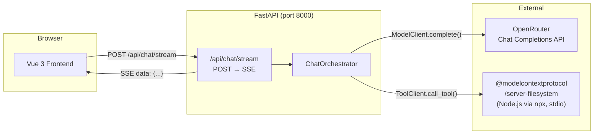

<p align="center">
  
</p>

<h1 align="center">ChatAgent</h1>

> A streaming AI chat interface where you can watch the model think — tool calls appear live, results populate in real time, and every step of the agent loop is visible in the UI.


---

## 🗂 Overview

ChatAgent is a local AI assistant that wires a Vue 3 frontend to a FastAPI backend running an agentic loop. The model (served via OpenRouter) can call real filesystem tools through the [Model Context Protocol](https://modelcontextprotocol.io) and, crucially, the frontend doesn't wait for the whole response before rendering — every event in the conversation is streamed over SSE and appended to the UI the moment it arrives.

The project was built to demonstrate a full-stack agent implementation: domain-driven backend architecture, clean tool-calling loop, real-time streaming, and a polished chat interface.

---

## ✨ Features

- **Live streaming** — conversation items appear one by one via `POST /api/chat/stream` (Server-Sent Events), not a bulk response
- **Transparent tool execution** — each tool call renders with a spinner, flips to ✓ with execution duration when its result arrives
- **MCP filesystem tools** — the model can list, read, and navigate files inside a sandboxed `demo-workspace/` directory
- **Markdown + syntax highlighting** — assistant replies render with `marked`, `highlight.js` (9 languages), and `DOMPurify`
- **Collapsible tool output** — long tool results collapse to a preview; a toggle expands the full content
- **Persistence** — conversations survive page refresh via `localStorage` (debounced writes)
- **Smart scroll** — the list only auto-scrolls when you're near the bottom; a jump button appears otherwise
- **New chat** — clears both the in-memory conversation on the frontend and `localStorage`

---

## 🏗 Architecture



The orchestrator (`app/application/chat_orchestrator.py`) sits between the API layer and two protocols — `ModelClient` and `ToolClient` — both defined in `app/domain/`. Neither the FastAPI routes nor the tests import any provider-specific code directly.

---

## 🔧 Technology Stack

| Layer | Technology |
|---|---|
| Frontend | Vue 3, TypeScript, Vite |
| Streaming | `fetch` + `ReadableStream` (SSE, no EventSource) |
| Markdown | `marked`, `highlight.js`, `DOMPurify` |
| Backend | FastAPI, Uvicorn, Pydantic v2, pydantic-settings |
| Model API | OpenRouter (OpenAI-compatible Chat Completions) |
| Tool Protocol | MCP Python SDK + `@modelcontextprotocol/server-filesystem` over stdio |
| Backend tests | pytest, pytest-asyncio, httpx (ASGI transport) |
| Frontend tests | Vitest, `@vue/test-utils`, jsdom |

---

## 📁 Project Structure

```
ChatAgent/
├── backend/
│   ├── app/
│   │   ├── api/
│   │   │   ├── chat.py              # POST /api/chat and /api/chat/stream
│   │   │   └── dependencies.py      # FastAPI DI: create clients, get orchestrator
│   │   ├── application/
│   │   │   └── chat_orchestrator.py # Agentic loop — chat() and chat_stream()
│   │   ├── domain/
│   │   │   ├── conversation.py      # Pydantic models: UserMessage, ToolCall, etc.
│   │   │   ├── model.py             # ModelClient protocol + request/response types
│   │   │   └── tools.py             # ToolClient protocol + ToolDefinition
│   │   ├── infrastructure/
│   │   │   ├── mcp/                 # MCPToolClient (stdio, mapper)
│   │   │   └── openrouter/          # OpenRouterClient (httpx, DTO, mapper)
│   │   ├── config.py                # pydantic-settings — reads backend/.env
│   │   └── main.py                  # FastAPI app, lifespan, CORS
│   └── tests/
│       ├── unit/test_orchestrator.py      # Mock model + tool clients
│       └── integration/test_chat_api.py   # Stub orchestrator via DI override
├── frontend/
│   ├── src/
│   │   ├── api/chatApi.ts           # streamMessage() async generator
│   │   ├── components/              # ConversationList, ChatComposer, item components
│   │   ├── lib/markdown.ts          # marked + highlight.js configured once at module load
│   │   └── models/conversation.ts   # TypeScript mirror of backend domain types
│   └── public/logo.png
├── demo-workspace/                  # MCP sandbox — only this directory is tool-accessible
└── README.md
```

---

## ⚙️ Setup

### Prerequisites

- Python 3.11+
- Node.js 18+ (for `npx` — used to run the MCP server at runtime)
- An [OpenRouter](https://openrouter.ai) API key

### Backend

```powershell
cd backend
python -m pip install -r requirements.txt
```

Create `backend/.env` (see template below), then:

```powershell
python -m uvicorn app.main:app --reload --port 8000
```

### Frontend

```powershell
cd frontend
npm install
npm run dev      # http://localhost:5173
```

### Environment variables

Create `backend/.env` with the following. The two required fields are `OPENROUTER_API_KEY` and `OPENROUTER_MODEL`; everything else has a working default.

```dotenv
# backend/.env

# Required
OPENROUTER_API_KEY=your-key-here
OPENROUTER_MODEL=openai/gpt-oss-20b:free   # any OpenRouter model ID

# Defaults — only set these if you change ports
OPENROUTER_BASE_URL=https://openrouter.ai/api/v1
OPENROUTER_REFERER=http://localhost:5173
CORS_ORIGIN=http://localhost:5173
MCP_FILESYSTEM_ROOT=./demo-workspace
```

`MCP_FILESYSTEM_ROOT` is the directory the MCP filesystem server is allowed to access. It defaults to `./demo-workspace`, which already contains sample files for testing.

---

## 💬 Usage

With both servers running, open `http://localhost:5173`. Type a message and press **Enter**. Try something that exercises tool use:

```
List all files in the workspace, then read notes.txt and summarise it.
```

You'll see your message appear immediately, followed by a spinning tool-call bubble when the model decides to use the filesystem, then the tool result, then the assistant's final reply — all streamed live.

**Keyboard shortcuts:** `Shift+Enter` for a new line inside the composer; `Escape` to clear the input.

**New chat:** the button in the header starts a fresh conversation and clears `localStorage`.

---

## 🤖 Agent / Tool-Calling Workflow

The agentic loop lives entirely in `app/application/chat_orchestrator.py`. The two public methods — `chat()` and `chat_stream()` — share the same logic; `chat_stream` is an async generator that yields each item the moment it is ready, while `chat` collects them into a list for the legacy endpoint.

The loop runs up to `_MAX_ITERATIONS` (8) times:

1. The user message is appended to `self._conversation` and yielded.
2. Available tools are fetched from `MCPToolClient.list_tools()`, which queries the live MCP server.
3. `OpenRouterClient.complete()` is called with the full conversation history and tool definitions. The response is either a plain text reply or a list of `ToolCallParams`.
4. For each tool call, a `ToolCall` item is yielded immediately (the spinner appears in the UI), then `MCPToolClient.call_tool()` executes it over stdio. The raw output is truncated at 20,000 characters before being yielded as a `ToolResult`.
5. The loop continues with the new context until the model returns a text reply — yielded as `AssistantMessage` — or an error is caught (timeout, HTTP error, tool failure), at which point an `ErrorItem` is yielded and the stream ends.

`ModelClient` and `ToolClient` are protocols in `app/domain/`. `ChatOrchestrator` depends only on those interfaces, never on `OpenRouterClient` or `MCPToolClient` directly. This makes the orchestrator independently unit-testable.

---

## 🧪 Testing

### Backend

Unit tests mock both the model and tool clients using `MockModelClient` and `MockToolClient`, defined in `tests/unit/test_orchestrator.py`. They drive the orchestrator through happy-path and error scenarios without any network or process calls.

Integration tests in `tests/integration/test_chat_api.py` override the `get_orchestrator` FastAPI dependency with a `StubOrchestrator` and use `httpx.AsyncClient` with `ASGITransport` to exercise the full HTTP layer in-process.

```powershell
cd backend
pytest                      # all tests
pytest tests/unit/          # unit only
pytest tests/integration/   # integration only
```

### Frontend

Component and unit tests use Vitest with `@vue/test-utils` and jsdom.

| File | What it covers |
|---|---|
| `src/api/__tests__/chatApi.test.ts` | SSE stream parsing, multi-item chunks, HTTP error handling |
| `src/components/__tests__/ChatComposer.test.ts` | Enter / Shift+Enter / Escape / disabled state / whitespace guard |
| `src/components/__tests__/ConversationList.test.ts` | Item type dispatch, ThinkingItem visibility, pending → success status |

```powershell
cd frontend
npm test
```

---

## 🗺 Roadmap

- **Provider fallback** — try a secondary model if the primary returns a 402 or 5xx, or run a local stub for offline demos
- **Persistent conversation storage** — store sessions server-side, keyed by ID, to support multi-turn history across restarts
- **Multi-user support** — currently a single `ChatOrchestrator` is shared across all requests; session-scoped instances would fix this
- **Streaming endpoint integration tests** — the `POST /api/chat/stream` path is unit-tested but has no integration coverage yet
- **Additional MCP servers** — the `ToolClient` protocol is server-agnostic; swapping in a web-search or code-execution MCP server requires no changes to the orchestrator
- **Auth** — API key or OAuth guard on the FastAPI routes


---

## What it does

The user types a message. The backend calls the model via OpenRouter, decides whether to invoke MCP filesystem tools, executes them, and **streams every event** (user message → tool call → tool result → assistant reply) back to the browser as Server-Sent Events. The frontend renders each item the moment it arrives — spinner while a tool runs, ✓ with execution time when it finishes, markdown + syntax highlighting on the final reply.

---

## Tech Stack

| Layer | Technology |
|---|---|
| Backend API | FastAPI + Uvicorn (ASGI) |
| Streaming | Server-Sent Events (`text/event-stream`) |
| Model | OpenRouter Chat Completions |
| Tool Protocol | MCP (`@modelcontextprotocol/server-filesystem` over stdio) |
| Frontend | Vue 3 + TypeScript + Vite |
| Markdown | `marked` + `highlight.js` + `DOMPurify` |
| Testing | Pytest (backend) · Vitest + Vue Test Utils (frontend) |

---

## Quick Start

**Backend**
```powershell
cd backend
python -m pip install -r requirements.txt
python -m uvicorn app.main:app --reload --port 8000
```

**Frontend**
```powershell
cd frontend
npm install
npm run dev          # http://localhost:5173
```

**Tests**
```powershell
cd backend && pytest
cd frontend && npm test
```

---

## Environment Variables

Create `backend/.env`:

| Variable | Description |
|---|---|
| `OPENROUTER_API_KEY` | Your OpenRouter API key |
| `OPENROUTER_MODEL` | Model ID e.g. `openai/gpt-oss-20b:free` |
| `MCP_FILESYSTEM_ROOT` | Sandbox directory for file tools (e.g. `./demo-workspace`) |
| `OPENROUTER_BASE_URL` | `https://openrouter.ai/api/v1` |
| `OPENROUTER_REFERER` | `http://localhost:5173` |
| `CORS_ORIGIN` | `http://localhost:5173` |

---

## Architecture

### Streaming flow

```
Browser  ──POST /api/chat/stream──▶  FastAPI
           SSE text/event-stream
  ◀── data: {user_message} ──────────  yield UserMessage
  ◀── data: {tool_call}    ──────────  yield ToolCall
                                       → MCPToolClient.call_tool()
  ◀── data: {tool_result}  ──────────  yield ToolResult
  ◀── data: {assistant_msg}──────────  yield AssistantMessage
  ◀── data: [DONE]         ──────────  stream closed
```

### Agentic loop (chat_orchestrator.py)

```mermaid
flowchart TD
    A[User sends message] --> B[yield UserMessage]
    B --> C[List tools from MCPToolClient]
    C --> D[ModelClient.complete — full history + tools]
    D --> E{Tool calls?}
    E -->|Yes| F[yield ToolCall]
    F --> G[Execute via MCP]
    G --> H[Truncate if > 20k chars]
    H --> I[yield ToolResult]
    I --> D
    E -->|No| J[yield AssistantMessage]
    J --> K[Stream ends]
    D --> L[Timeout / HTTP error]
    L --> M[yield ErrorItem]
    M --> K
```

### Frontend state machine (per message)

```
idle → loading → streaming items one-by-one → idle
         │
         ▼
   ThinkingItem shown
   tool_call  → spinner (pending)
   tool_result → ✓ {duration}ms
   assistant  → markdown + syntax highlight
```

---

## Project Structure

```
ChatAgent/
├── backend/
│   ├── app/
│   │   ├── api/            # FastAPI routes + dependencies
│   │   ├── application/    # ChatOrchestrator (agentic loop)
│   │   ├── domain/         # Conversation models, protocols
│   │   └── infrastructure/ # OpenRouter client · MCP client
│   └── tests/
│       ├── unit/           # Orchestrator unit tests
│       └── integration/    # Chat API integration tests
├── frontend/
│   ├── src/
│   │   ├── api/            # streamMessage (SSE generator)
│   │   ├── components/     # Chat UI components
│   │   ├── lib/            # marked + highlight.js config
│   │   └── models/         # TypeScript conversation types
│   └── public/             # Static assets (logo)
└── demo-workspace/         # MCP sandbox directory
```

---

## Key Design Decisions

**Ports and adapters** — `ChatOrchestrator` depends on `ModelClient` and `ToolClient` protocols, not concrete implementations. Swap the model or tool provider without touching orchestration logic.

**SSE over WebSocket** — SSE is unidirectional, request/response-shaped, and works over standard HTTP. No handshake overhead, no connection state to manage. The frontend uses `fetch` + `ReadableStream` directly (not `EventSource`) to support `POST` with a JSON body.

**Tool call visibility** — each `tool_call` is yielded *before* the tool executes. The UI shows a live spinner during execution and flips to ✓ with duration when `tool_result` arrives. A 200 ms `setTimeout` in the frontend guarantees the spinner is visible even for sub-frame tool executions.

**Legacy endpoint** — `POST /api/chat` (returns full list) is kept for backward-compatibility with existing integration tests.

**localStorage persistence** — conversation items are serialised to `localStorage` with a 200 ms debounce to avoid a write on every streamed token. A "New chat" button clears both the reactive state and storage.

---

## What's Next

- [ ] Provider fallback + local mock model so demos work without OpenRouter credits
- [ ] Server-side conversation persistence keyed by session ID
- [ ] Integration test coverage for the streaming endpoint
- [ ] Replace the fixed 200 ms spinner delay with a backend progress event reflecting real tool latency
- [ ] Conversation history sidebar with localStorage-backed sessions
