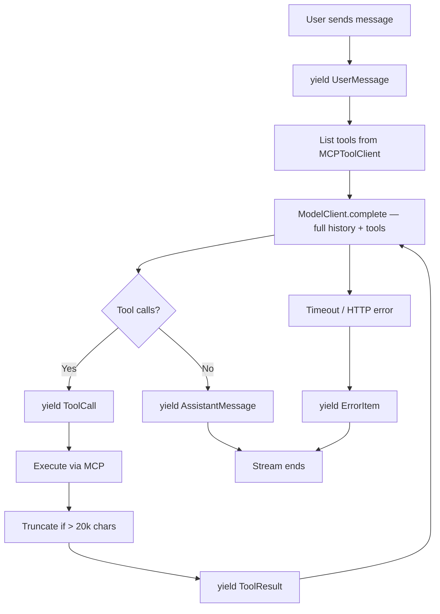

# ChatAgent

> **Real-time AI chat with live tool execution** — streams every conversation event as it happens, powered by OpenRouter + MCP filesystem tools.


---

## What it does

The user types a message. The backend calls the model via OpenRouter, decides whether to invoke MCP filesystem tools, executes them, and **streams every event** (user message → tool call → tool result → assistant reply) back to the browser as Server-Sent Events. The frontend renders each item the moment it arrives — spinner while a tool runs, ✓ with execution time when it finishes, markdown + syntax highlighting on the final reply.

---

## Tech Stack

| Layer | Technology |
|---|---|
| Backend API | FastAPI + Uvicorn (ASGI) |
| Streaming | Server-Sent Events (`text/event-stream`) |
| Model | OpenRouter Chat Completions |
| Tool Protocol | MCP (`@modelcontextprotocol/server-filesystem` over stdio) |
| Frontend | Vue 3 + TypeScript + Vite |
| Markdown | `marked` + `highlight.js` + `DOMPurify` |
| Testing | Pytest (backend) · Vitest + Vue Test Utils (frontend) |

---

## Quick Start

**Backend**
```powershell
cd backend
python -m pip install -r requirements.txt
python -m uvicorn app.main:app --reload --port 8000
```

**Frontend**
```powershell
cd frontend
npm install
npm run dev          # http://localhost:5173
```

**Tests**
```powershell
cd backend && pytest
cd frontend && npm test
```

---

## Environment Variables

Create `backend/.env`:

| Variable | Description |
|---|---|
| `OPENROUTER_API_KEY` | Your OpenRouter API key |
| `OPENROUTER_MODEL` | Model ID e.g. `openai/gpt-oss-20b:free` |
| `MCP_FILESYSTEM_ROOT` | Sandbox directory for file tools (e.g. `./demo-workspace`) |
| `OPENROUTER_BASE_URL` | `https://openrouter.ai/api/v1` |
| `OPENROUTER_REFERER` | `http://localhost:5173` |
| `CORS_ORIGIN` | `http://localhost:5173` |

---

## Architecture

### Streaming flow

```
Browser  ──POST /api/chat/stream──▶  FastAPI
           SSE text/event-stream
  ◀── data: {user_message} ──────────  yield UserMessage
  ◀── data: {tool_call}    ──────────  yield ToolCall
                                       → MCPToolClient.call_tool()
  ◀── data: {tool_result}  ──────────  yield ToolResult
  ◀── data: {assistant_msg}──────────  yield AssistantMessage
  ◀── data: [DONE]         ──────────  stream closed
```

### Agentic loop (chat_orchestrator.py)



### Frontend state machine (per message)

```
idle → loading → streaming items one-by-one → idle
         │
         ▼
   ThinkingItem shown
   tool_call  → spinner (pending)
   tool_result → ✓ {duration}ms
   assistant  → markdown + syntax highlight
```

---

## Project Structure

```
ChatAgent/
├── backend/
│   ├── app/
│   │   ├── api/            # FastAPI routes + dependencies
│   │   ├── application/    # ChatOrchestrator (agentic loop)
│   │   ├── domain/         # Conversation models, protocols
│   │   └── infrastructure/ # OpenRouter client · MCP client
│   └── tests/
│       ├── unit/           # Orchestrator unit tests
│       └── integration/    # Chat API integration tests
├── frontend/
│   ├── src/
│   │   ├── api/            # streamMessage (SSE generator)
│   │   ├── components/     # Chat UI components
│   │   ├── lib/            # marked + highlight.js config
│   │   └── models/         # TypeScript conversation types
│   └── public/             # Static assets (logo)
└── demo-workspace/         # MCP sandbox directory
```

---

## Key Design Decisions

**Ports and adapters** — `ChatOrchestrator` depends on `ModelClient` and `ToolClient` protocols, not concrete implementations. Swap the model or tool provider without touching orchestration logic.

**SSE over WebSocket** — SSE is unidirectional, request/response-shaped, and works over standard HTTP. No handshake overhead, no connection state to manage. The frontend uses `fetch` + `ReadableStream` directly (not `EventSource`) to support `POST` with a JSON body.

**Tool call visibility** — each `tool_call` is yielded *before* the tool executes. The UI shows a live spinner during execution and flips to ✓ with duration when `tool_result` arrives. A 200 ms `setTimeout` in the frontend guarantees the spinner is visible even for sub-frame tool executions.

**Legacy endpoint** — `POST /api/chat` (returns full list) is kept for backward-compatibility with existing integration tests.

**localStorage persistence** — conversation items are serialised to `localStorage` with a 200 ms debounce to avoid a write on every streamed token. A "New chat" button clears both the reactive state and storage.

---

## What's Next

- [ ] Provider fallback + local mock model so demos work without OpenRouter credits
- [ ] Server-side conversation persistence keyed by session ID
- [ ] Integration test coverage for the streaming endpoint
- [ ] Replace the fixed 200 ms spinner delay with a backend progress event reflecting real tool latency
- [ ] Conversation history sidebar with localStorage-backed sessions
