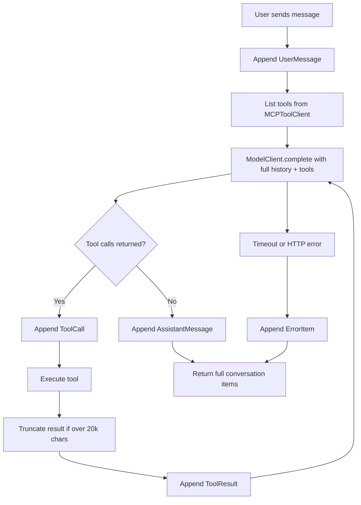

# ChatAgent

## 1. Summary
This app is a local chat interface that sends a user message to a FastAPI backend, lets the model decide whether to call filesystem tools through MCP, executes those tools, and returns the full conversation history on every request. The frontend renders user messages, assistant messages, tool calls, tool results, and errors as separate item types so you can see exactly what happened.

## 2. Model + MCP Tool Used
Model client: OpenRouter chat completions via `OpenRouterClient` in `backend/app/infrastructure/openrouter/client.py`.

Configured model in `.env`: `OPENROUTER_MODEL` (I tested multiple IDs, including free ones) such as `OPENROUTER_MODEL=openai/gpt-oss-20b:free` and `OPENROUTER_MODEL=anthropic/claude-3-haiku`. I prioritized lower-cost models for demo runs, but account-side OpenRouter access/billing returned HTTP 402 during live tests.

Tool layer: official MCP Python SDK using `@modelcontextprotocol/server-filesystem` over stdio in `backend/app/infrastructure/mcp/client.py`. I chose filesystem MCP because it is simple to demo, easy to verify in logs, and easy to sandbox.

## 3. API Config
Required env vars in `backend/.env`:

- `OPENROUTER_API_KEY`
- `OPENROUTER_MODEL`
- `MCP_FILESYSTEM_ROOT`
- `OPENROUTER_BASE_URL`
- `OPENROUTER_REFERER`
- `CORS_ORIGIN`

## 4. Run Instructions
Backend:
```powershell
cd backend
python -m pip install -r requirements.txt
python -m uvicorn app.main:app --reload --port 8000
```

Frontend:
```powershell
cd frontend
npm install
npm run dev
```

Quick API test:
```powershell
$body = @{ message = 'List files in the demo workspace and then read notes.txt' } | ConvertTo-Json
Invoke-RestMethod -Method Post -Uri 'http://127.0.0.1:8000/api/chat' -ContentType 'application/json' -Body $body
```

## 5. Orchestration Flow
The loop lives in `backend/app/application/chat_orchestrator.py`. It appends a `UserMessage`, calls the model with full history plus available tools, appends `ToolCall` items when present, executes each tool through `ToolClient`, appends `ToolResult`, and calls the model again. If no tool calls are returned, it appends `AssistantMessage` and returns the full item list. Safeguards include max iterations, timeout/error mapping, and result truncation.



## 6. Design Decisions and Trade-offs
Ports and adapters: the orchestrator depends on `ModelClient` and `ToolClient` protocols, not concrete clients. That keeps unit tests isolated.

In-memory state: conversation is stored in `ChatOrchestrator._conversation`. This is simple for a single demo flow, but not multi-user safe and not persistent.

Full-list response: `POST /api/chat` returns the full list (`backend/app/api/chat.py`) instead of deltas. It is easy to render and debug, but less efficient as history grows.

Filesystem scope: MCP is restricted to `demo-workspace` and root-resolved in `backend/app/api/dependencies.py`.

Out of scope by design: auth, persistence, streaming, and multi-user routing. I skipped them to focus on the core agent loop and MCP integration.

## 7. What I'd Do Differently With More Time
1. Add provider fallback and a local mock model mode so demos keep working when external model access fails.
2. Move conversation state to persistent storage keyed by conversation id.
3. Expand frontend and integration test coverage around item rendering and failure paths.
